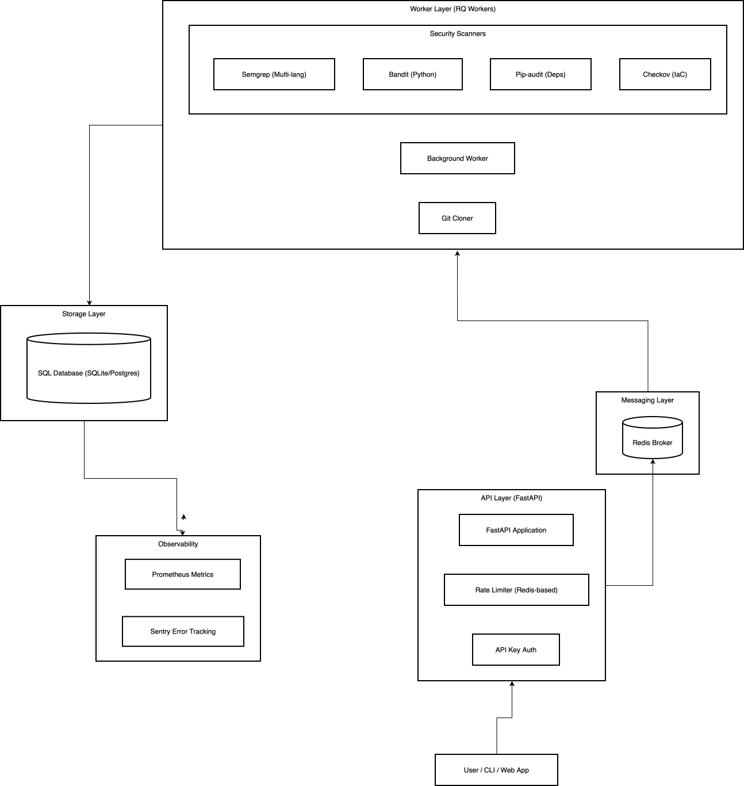

# Security & Compliance Monitoring — Backend (FastAPI) 🛡

Minimal scaffold for the Security & Compliance Monitoring API (FastAPI).

What you get
- Runnable FastAPI app with a simple scan API (POST /api/v1/scans)
- **Real security scanners**: Bandit (Python static analysis), Checkov (IaC security), pip-audit (dependency vulnerabilities)
- SQLite default dev DB (configurable via DATABASE_URL)
- Dockerfile + docker-compose for local dev
- Unit test + GitHub Actions CI scaffold

## Security Scanners

The platform integrates four industry-standard security scanners:

1. **Semgrep** - Multi-language static analysis
   - Supports 18+ languages: Python, JavaScript, TypeScript, Java, Go, Ruby, PHP, C/C++, C#, Rust, Kotlin, Scala, Swift
   - Uses Semgrep Registry community rules
   - OWASP Top 10 and CWE coverage

2. **Bandit** - Python static security analysis
   - Detects hard-coded secrets, SQL injection, shell injection, insecure crypto
   - 68+ built-in security checks
   - Severity-based risk scoring

2. **Checkov** - Infrastructure as Code security
   - Scans Terraform, Dockerfile, Kubernetes, CloudFormation
   - 1000+ built-in policies (CIS, PCI-DSS, HIPAA compliance)
   - Identifies misconfigurations before deployment

3. **pip-audit** - Python dependency vulnerability scanning
   - Checks for known CVEs in dependencies
   - Uses PyPI Advisory Database
   - Provides upgrade recommendations

### Scanner Workflow

1. Repository is cloned to temporary directory
2. All applicable scanners run in parallel
3. Findings are aggregated and stored in database
4. Risk score calculated based on severity (0-10 scale)
5. Temporary files cleaned up



Quickstart (macOS):

1) Create virtualenv and run locally

```bash
python -m venv .venv
source .venv/bin/activate
pip install -r requirements.txt
uvicorn app.main:app --reload
```

2) With Docker Compose

```bash
docker compose up --build
# API -> https://code-security-platform.onrender.com
```

### Command Line Interface (CLI) 💻

The platform includes a powerful CLI script to trigger scans and resolutions directly from your terminal.

#### 1. Installation
Ensure you have the dependencies installed:
```bash
pip install typer[all] rich requests
```

#### 2. Usage
Run the CLI as a Python module from the project root:

```bash
# Authenticate (Set your API key)
python -m src.app.cli auth --key <YOUR_API_KEY>

# Start a scan
python -m src.app.cli scan https://github.com/owner/repo

# Check scan status
python -m src.app.cli status <scan_id>

# Resolve findings (Bulk fix for a scan)
python -m src.app.cli resolve <scan_id>

# Check your quota
python -m src.app.cli usage
```

### Authentication

The platform supports **JWT Authentication** (via login) and **API Key Authentication** (for automated services).

#### 1. Register & Login (JWT)

```bash
# Register
curl -X POST https://code-security-platform.onrender.com/api/v1/auth/register \
     -H "Content-Type: application/json" \
     -d '{ "email": "user@example.com", "password": "yourpassword" }'

# Login
curl -X POST https://code-security-platform.onrender.com/api/v1/auth/login \
     -H "Content-Type: application/json" \
     -d '{ "email": "user@example.com", "password": "yourpassword" }'
# Response: { "access_token": "...", "token_type": "bearer" }
```

Use the `access_token` in the `Authorization: Bearer <token>` header for all subsequent requests.

#### 2. API Key Authentication

Generate an API key after logging in (`POST /api/v1/user/api-key`), then use it via the `x-api-key` header:

```bash
curl https://code-security-platform.onrender.com/api/v1/scans \
     -H "x-api-key: <YOUR_API_KEY>"
```

---

### Plans & Quotas

Every user is assigned a plan that controls their monthly scan and resolution limits.

| Plan | Monthly Scans | Monthly Resolves |
|---|---|---|
| `free` | 2 | 2 |
| `team` | 500 | 500 |
| `enterprise` | 2000 | 2000 |

- New users are automatically placed on the **Free** plan.
- Check your current plan and quotas at `GET /api/v1/user/profile`.
- Check current-month usage at `GET /api/v1/user/usage`.
- When a quota is exceeded the API returns `403` with a descriptive message indicating which quota was hit and that an upgrade is required.
- **Upgrade/Transition Plans**:
  - `POST /api/v1/user/subscription/team`: Move to the **Team** tier.
  - `POST /api/v1/user/subscription/enterprise`: Move to the **Enterprise** tier.
- Renew / reset your current monthly quotas with `POST /api/v1/user/subscription/renew`.

---

### API Reference

All protected endpoints accept either `Authorization: Bearer <JWT_TOKEN>` or `x-api-key: <API_KEY>`.

#### Authentication

| Method | Endpoint | Description |
|--------|----------|-------------|
| `POST` | `/api/v1/auth/register` | Register a new user account |
| `POST` | `/api/v1/auth/init-superuser` | Bootstraps the system by creating the first superuser. Returns `403` if a superuser already exists. |
| `POST` | `/api/v1/auth/login` | JSON login — returns a JWT. Returns `404` if the email is not found, `401` for a wrong password |
| `POST` | `/api/v1/auth/token` | OAuth2 form-data login — returns a JWT |
| `POST` | `/api/v1/auth/request-password-recovery` | Send a password recovery email. Requires `email`. |
| `POST` | `/api/v1/auth/reset-password` | Reset password. Requires a valid reset `token` and a `new_password`. |

```bash
# Register
curl -X POST https://code-security-platform.onrender.com/api/v1/auth/register \
     -H "Content-Type: application/json" \
     -d '{ "email": "user@example.com", "password": "yourpassword" }'

# Create Initial Superuser (Run only once to bootstrap)
curl -X POST https://code-security-platform.onrender.com/api/v1/auth/init-superuser \
     -H "Content-Type: application/json" \
     -d '{ "email": "admin@example.com", "password": "secureadminpassword" }'

# Login (JSON)
curl -X POST https://code-security-platform.onrender.com/api/v1/auth/login \
     -H "Content-Type: application/json" \
     -d '{ "email": "user@example.com", "password": "yourpassword" }'
# Response: { "access_token": "...", "token_type": "bearer" }

# Request Password Recovery
curl -X POST https://code-security-platform.onrender.com/api/v1/auth/request-password-recovery \
     -H "Content-Type: application/json" \
     -d '{ "email": "user@example.com" }'

# Reset Password (using token from email/logs)
curl -X POST https://code-security-platform.onrender.com/api/v1/auth/reset-password \
     -H "Content-Type: application/json" \
     -d '{ "token": "<JWT_TOKEN>", "new_password": "newsecurepassword" }'
```

---

#### User

| Method | Endpoint | Auth Required | Description |
|--------|----------|---------------|-------------|
| `GET` | `/api/v1/user/profile` | ✅ | Get profile and quota info for the authenticated user |
| `PUT` | `/api/v1/user/profile` | ✅ | Update optional attributes (like `slack_webhook_url` or `github_token`) |
| `GET` | `/api/v1/user/usage` | ✅ | Get usage history and current-month credit summary |
| `POST` | `/api/v1/user/api-key` | ✅ | Generate a new API key for the authenticated user |
| `POST` | `/api/v1/user/subscription/team` | ✅ | Upgrade user to the Team Tier |
| `POST` | `/api/v1/user/subscription/enterprise` | ✅ | Upgrade user to the Enterprise Tier |
| `POST` | `/api/v1/user/subscription/renew` | ✅ | Renew current monthly quota (optionally pass `?amount=100.0`) |

```bash
# Update user profile
curl -X PUT https://code-security-platform.onrender.com/api/v1/user/profile \
     -H "Authorization: Bearer <JWT_TOKEN>" \
     -H "Content-Type: application/json" \
     -d '{ "slack_webhook_url": "https://hooks.slack.com/services/...", "github_token": "ghp_..." }'

# Get usage
curl https://code-security-platform.onrender.com/api/v1/user/usage \
     -H "Authorization: Bearer <JWT_TOKEN>"

# Renew quota
curl -X POST "https://code-security-platform.onrender.com/api/v1/user/subscription/renew?amount=100.0" \
     -H "Authorization: Bearer <JWT_TOKEN>"

# Upgrade to Team Plan
curl -X POST https://code-security-platform.onrender.com/api/v1/user/subscription/team \
     -H "Authorization: Bearer <JWT_TOKEN>"
```

---

#### Admin

| Method | Endpoint | Auth Required | Description |
|--------|----------|---------------|-------------|
| `GET` | `/api/v1/admin/users` | ✅ (superuser) | List all registered users |
| `PUT` | `/api/v1/admin/users/{user_id}` | ✅ (superuser) | Update a user's plan, quota, or `is_superuser` status |
| `GET` | `/api/v1/admin/scans` | ✅ (superuser) | List all security scans on the platform |
| `GET` | `/api/v1/admin/findings/fixed` | ✅ (superuser) | List all fixed vulnerabilities across the platform |
| `GET` | `/api/v1/admin/health/stats` | ✅ (superuser) | Get system-wide health percentage and security stats |
| `GET` | `/api/v1/admin/events` | ✅ (superuser) | List latest platform-wide events (scans, resolutions, etc.). Supports `offset` and `limit` (default 3). |
| `POST` | `/api/v1/admin/scans/requeue` | ✅ (superuser) | Re-enqueue all scans stuck in 'queued' status. |

```bash
# List users
curl https://code-security-platform.onrender.com/api/v1/admin/users \
     -H "Authorization: Bearer <SUPERUSER_JWT>"

# Promote user to enterprise
curl -X PUT https://code-security-platform.onrender.com/api/v1/admin/users/<USER_ID> \
     -H "Authorization: Bearer <SUPERUSER_JWT>" \
     -H "Content-Type: application/json" \
     -d '{ "plan": "enterprise" }'

# List all scans on platform
curl https://code-security-platform.onrender.com/api/v1/admin/scans \
     -H "Authorization: Bearer <SUPERUSER_JWT>"

# List all fixed vulnerabilities on platform
curl https://code-security-platform.onrender.com/api/v1/admin/findings/fixed \
     -H "Authorization: Bearer <SUPERUSER_JWT>"

# Get overall system health percentage
curl https://code-security-platform.onrender.com/api/v1/admin/health/stats \
     -H "Authorization: Bearer <SUPERUSER_JWT>"

# Get latest platform events (paginated, shows 3 by default)
curl https://code-security-platform.onrender.com/api/v1/admin/events \
     -H "Authorization: Bearer <SUPERUSER_JWT>"

# Get legacy events with custom offset/limit
curl "https://code-security-platform.onrender.com/api/v1/admin/events?offset=3&limit=5" \
     -H "Authorization: Bearer <SUPERUSER_JWT>"
```

---


#### Scans

| Method | Endpoint | Auth Required | Description |
|--------|----------|---------------|-------------|
| `POST` | `/api/v1/scans` | ✅ (quota enforced) | Start a new security scan |
| `GET` | `/api/v1/scans` | ✅ | List all scans for the authenticated user |
| `GET` | `/api/v1/scans/{scan_id}` | ✅ | Get details of a specific scan |
| `DELETE` | `/api/v1/scans/{scan_id}` | ✅ | Remove a scan that is currently in 'queued' state |

```bash
# Start a scan
curl -X POST https://code-security-platform.onrender.com/api/v1/scans \
     -H "Authorization: Bearer <JWT_TOKEN>" \
     -H "Content-Type: application/json" \
     -d '{ "repo_url": "https://github.com/owner/repo" }'

# Remove a queued scan
curl -X DELETE https://code-security-platform.onrender.com/api/v1/scans/{scan_id} \
     -H "Authorization: Bearer <JWT_TOKEN>"
```

---

#### Findings & Resolution

| Method | Endpoint | Auth Required | Description |
|--------|----------|---------------|-------------|
| `GET` | `/api/v1/findings/fixed` | ✅ | List all successfully resolved vulnerabilities |
| `POST` | `/api/v1/findings/{target_id}/resolve` | ✅ (quota enforced) | Resolve a finding or all findings in a scan |

Pass a **Finding ID** to fix one vulnerability or a **Scan ID** to fix all findings in that scan.  
Add `?force_sync=true` to wait for the result synchronously.

```bash
curl -X POST "https://code-security-platform.onrender.com/api/v1/findings/<ID>/resolve?force_sync=true" \
     -H "Authorization: Bearer <JWT_TOKEN>" \
     -H "Content-Type: application/json" \
     -d '{ "github_token": "your_personal_access_token" }'
```

---

#### Observability

| Method | Endpoint | Description |
|--------|----------|-------------|
| `GET` | `/api/v1/metrics` | Prometheus metrics (CPU, request counts, latencies, etc.) |

---

## Running the worker (queue mode)

- Local (dev):
```bash
# start a local redis (homebrew) or use docker-compose (recommended)
redis-server --port 6379 &
REDIS_URL=redis://localhost:6379 rq worker scans
# or use the convenience entrypoint
REDIS_URL=redis://localhost:6379 python -m app.worker
```

- With Docker Compose (recommended):
```bash
docker compose up --build
# api -> https://code-security-platform.onrender.com
# worker logs are visible in the `worker` service
```

## Observability (Prometheus + Sentry) 📈

- API metrics: `GET /api/v1/metrics` (Prometheus format)
- Worker metrics: exposed on `9100` by default when running the worker
- Sentry: set `SENTRY_DSN` to enable error reporting from API & worker

Example (local):
```bash
# run everything with docker-compose
SENTRY_DSN="" docker compose up --build
# scrape metrics from https://security-compliance-platform.fly.dev/metrics and http://localhost:9100/
```

## CI / running without Redis

- The scaffold supports a synchronous fallback for local dev and CI. Set `WORKER_SYNC=true` to run scan jobs synchronously (the default in tests/CI).